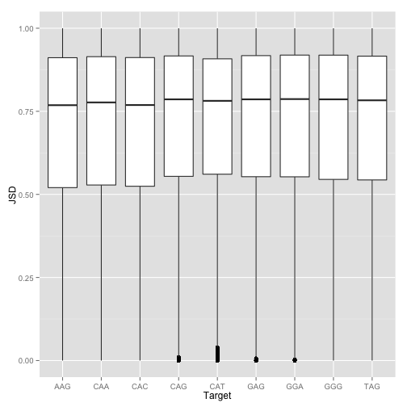
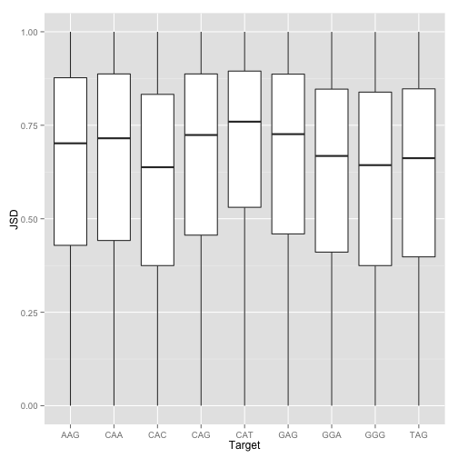

F3 Low Stringency Analysis
========================================================

## Load libraries


```r
library(ggplot2)
```


## Import the data and basic stuff

```r
tableFile <- "../data/b1hdata/6varpos/F3/low/protein_seqs_JSD/all_cut10.txt"
lab1 <- "../rsessions/F3_low_6pos_all.rda"
lab2 <- "../rsessions/F3_low_6pos_cut10.rda"
fname <- "../data/b1hData/newDatabase/6varpos/F3/low/protein_seqs_JSD/all.txt"
data <- read.delim(fname, header = FALSE)
lapply(data[1, ], class)
```

```
## $V1
## [1] "factor"
## 
## $V2
## [1] "factor"
## 
## $V3
## [1] "numeric"
## 
## $V4
## [1] "integer"
## 
## $V5
## [1] "integer"
## 
## $V6
## [1] "numeric"
```

```r
head(data)
```

```
##    V1     V2       V3 V4 V5     V6
## 1 AAA WRSWLA 0.002246 27 54 0.3452
## 2 AAA WPSWRS 0.001276 18 54 0.6126
## 3 AAA WRSWRA 0.001255 30 54 0.5807
## 4 AAA QLGNRS 0.001226 24 54 0.6681
## 5 AAA WPSWRA 0.001137 19 36 0.4579
## 6 AAA YPSWRA 0.001097 15 36 0.4430
```

```r
length(unique(data$V2))
```

```
## [1] 1779996
```


## Drop the 10 lowest counts for each target

```r
sortedTargs <- sort(unique(data$V1))
minCounts <- vector(mode = "numeric", length = length(sortedTargs))

cut10data <- data.frame()
lastrows <- 0
for (i in 1:length(sortedTargs)) {
    minCounts[i] <- tail(sort(unique(subset(data, V1 == sortedTargs[i])$V3), 
        decreasing = TRUE), 10)[1]
    cut10data <- rbind(cut10data, subset(data, V3 > minCounts[i] & V1 == sortedTargs[i]))
    rows <- nrow(cut10data) - lastrows
    lastrows <- nrow(cut10data)
    print(paste0(sortedTargs[i], ":  ", rows, " (", rows/nrow(subset(data, V1 == 
        sortedTargs[i])), ")"))
}
```

```
## [1] "AAA:  14651 (0.249803921568627)"
## [1] "AAC:  9477 (0.297625777275297)"
## [1] "AAG:  10091 (0.271132247837068)"
## [1] "AAT:  11595 (0.282646320356873)"
## [1] "ACA:  11120 (0.235080227469717)"
## [1] "ACC:  1224 (0.172661870503597)"
## [1] "ACG:  9460 (0.290531617579313)"
## [1] "ACT:  7716 (0.243046587079094)"
## [1] "AGA:  1152 (0.185030517185994)"
## [1] "AGC:  18080 (0.343360680644181)"
## [1] "AGG:  10992 (0.308668669793041)"
## [1] "AGT:  11768 (0.310862214708369)"
## [1] "ATA:  11685 (0.264707881204268)"
## [1] "ATC:  10231 (0.284922579926479)"
## [1] "ATG:  8244 (0.250417666535038)"
## [1] "ATT:  10714 (0.278734585566367)"
## [1] "CAA:  5396 (0.181329390416023)"
## [1] "CAC:  10374 (0.271003134796238)"
## [1] "CAG:  9498 (0.297612333145328)"
## [1] "CAT:  9680 (0.22926979465195)"
## [1] "CCA:  13385 (0.307658713740633)"
## [1] "CCC:  5835 (0.198273811546434)"
## [1] "CCG:  11955 (0.31844334345533)"
## [1] "CCT:  8304 (0.201255422796345)"
## [1] "CGA:  19767 (0.26686197213522)"
## [1] "CGC:  16701 (0.320034492670308)"
## [1] "CGG:  3163 (0.251730998806208)"
## [1] "CGT:  10426 (0.271871495997288)"
## [1] "CTA:  13111 (0.187737159385426)"
## [1] "CTC:  10679 (0.224071004427286)"
## [1] "CTG:  12966 (0.181258999342961)"
## [1] "CTT:  44479 (0.316263625310191)"
## [1] "GAA:  7575 (0.23131889944117)"
## [1] "GAC:  10475 (0.255344562806231)"
## [1] "GAG:  15865 (0.352963424401531)"
## [1] "GAT:  16018 (0.290049796287913)"
## [1] "GCA:  6692 (0.216401500452723)"
## [1] "GCC:  9357 (0.214079802324517)"
## [1] "GCG:  11847 (0.29165435745938)"
## [1] "GCT:  12383 (0.245159374381311)"
## [1] "GGA:  6969 (0.234836231298019)"
## [1] "GGC:  12382 (0.260662708938571)"
## [1] "GGG:  14895 (0.310914897614127)"
## [1] "GGT:  15850 (0.319453402128346)"
## [1] "GTA:  8386 (0.257784882112447)"
## [1] "GTC:  12020 (0.282232501350114)"
## [1] "GTG:  14754 (0.299360860302323)"
## [1] "GTT:  20324 (0.305573514155553)"
## [1] "TAA:  3085 (0.144422077618089)"
## [1] "TAC:  9468 (0.317686138979297)"
## [1] "TAG:  6482 (0.251006815365551)"
## [1] "TAT:  10504 (0.326748996795969)"
## [1] "TCA:  12262 (0.213605086664925)"
## [1] "TCC:  5229 (0.252060737527115)"
## [1] "TCG:  5425 (0.229105958866506)"
## [1] "TCT:  13223 (0.292861730637195)"
## [1] "TGA:  10770 (0.337099752730915)"
## [1] "TGC:  19039 (0.38477395363877)"
## [1] "TGG:  2697 (0.223428050700025)"
## [1] "TGT:  29879 (0.434407757956412)"
## [1] "TTA:  40186 (0.39093341115813)"
## [1] "TTC:  15062 (0.301348485454764)"
## [1] "TTG:  8667 (0.230990645238666)"
## [1] "TTT:  12327 (0.285956203024961)"
```

```r

nrow(cut10data)
```

```
## [1] 764016
```

```r
nrow(data)
```

```
## [1] 2729067
```

```r
nrow(cut10data)/nrow(data)
```

```
## [1] 0.28
```


## Make plot of JSD for all data

```r
JSDbpAll <- ggplot(data, aes(x = V1, y = V6)) + geom_boxplot() + xlab("Target") + 
    ylab("JSD")
print(JSDbpAll)
```

 


## Make plot of JSD for cut10data

```r
JSDbpCut10 <- ggplot(cut10data, aes(x = V1, y = V6)) + geom_boxplot() + xlab("Target") + 
    ylab("JSD")
print(JSDbpCut10)
```

 


## Save the data

```r
write.table(cut10data, file = tableFile, sep = "\t", quote = FALSE, eol = "\n", 
    row.names = FALSE, col.names = FALSE)
```

```
## Warning: cannot open file
## '../data/b1hdata/6varpos/F3/low/protein_seqs_JSD/all_cut10.txt': No such
## file or directory
```

```
## Error: cannot open the connection
```

```r
save(data, file = lab1)
save(cut10data, JSDbpAll, JSDbpCut10, file = lab2)
```

